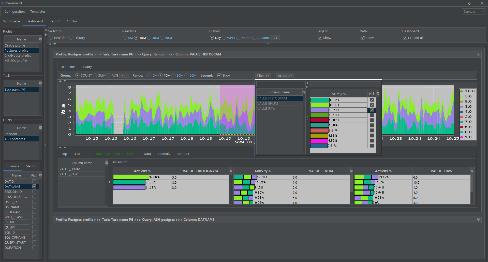
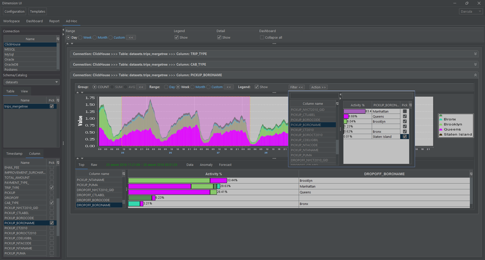
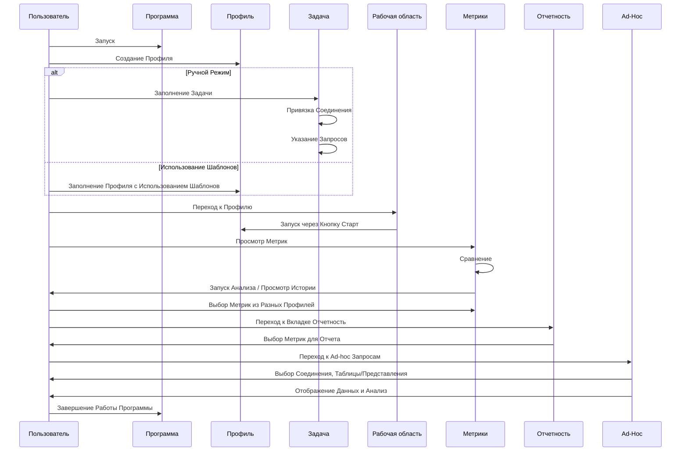

# Dimension UI

## Оглавление

- [Описание программы](#описание-программы)
    - [Общие сведения](#общие-сведения)
    - [Направления прикладного использования](#направления-прикладного-использования)
    - [Минимальные технические требования](#минимальные-технические-требования)
    - [Начало работы с проектом](#начало-работы-с-проектом)
        - [Сборка проекта](#сборка-проекта)
        - [Установка и настройка](#установка-и-настройка)
    - [Описание логической структуры](#описание-логической-структуры)
        - [Архитектура приложения](#архитектура-приложения)
        - [Алгоритмы](#алгоритмы)
            - [Z-нормализованное евклидово расстояние](#z-нормализованное-евклидово-расстояние)
        - [API программы](#api-программы)
            - [Используемые методы](#используемые-методы)
            - [Входные параметры](#входные-параметры)
            - [Выходные параметры](#выходные-параметры)
        - [GUI программы](#gui-программы)
          - [Диаграмма последовательности GUI](#диаграмма-последовательности-gui)
          - [Управление конфигурацией](#управление-конфигурацией)
          - [Интерфейс Workspace](#интерфейс-workspace)
          - [Интерфейс Dashboard](#интерфейс-dashboard)
          - [Интерфейс Report](#интерфейс-report)
          - [Интерфейс Ad-hoc](#интерфейс-ad-hoc)
          - [Screencast](#screencast)
        - [Варианты использования кода](#варианты-использования-кода)
          - [Установка темы LaF при старте приложения](#установка-темы-laf-при-старте-приложения)
- [Загрузка](#загрузка)
- [Разработка](#разработка)
  - [CI/CD](#cicd)
- [Документация](#документация)
- [Лицензия](#лицензия)
- [Контакты](#контакты)

## Описание программы
**Dimension UI** - это настольное приложение, предназначенное для сбора, хранения, визуализации и анализа данных временных рядов.







### Общие сведения

Ключевые особенности **Dimension UI**:
- **Сбор и анализ данных в режиме реального времени**. Данные собираются в режиме реального времени, что позволяет пользователям отслеживать метрики в режиме онлайн, анализировать реакцию на различные виды воздействия, просматривать историю и проводить сравнительный анализ с другими показателями;
- **Гибкая и быстрая настройка профилей сбора данных**. Эта функция особенно полезна, когда скорость имеет первостепенное значение и пользователям необходимо быстро собрать специальные статистические данные для более детальной оценки характеристик системы или компонента;
- **Локальное хранение в специализированной БД **Dimension DB**** (репозитории проекта на [**GitFlic**](https://gitflic.ru/project/akardapolov/dimension-db) и [**GitHub**](https://github.com/akardapolov/dimension-db)) блочно-колоночного типа со встроенным сжатием данных и дедупликацией;
- **Продвинутые возможности по интеллектуальному анализу данных временных рядов** с использованием [Matrix profile](https://www.cs.ucr.edu/~eamonn/MatrixProfile.html) и ARIMA;
- **Визуализация данных временных рядов во внешних БД по JDBC** с использованием автоматической генерации SQL-запросов к источникам данных, режим No-code;
- **Система информационных панелей** для отображения метрик из разных источников в одном интерфейсе. Быстрый доступ к метрикам облегчает работу пользователей по просмотру больших объемов анализируемых данных;
- **Система создания отчетов** по собранным данным в формате PDF для последующего анализа.

[Вернуться в Оглавление](#Оглавление)

### Направления прикладного использования

1. Мониторинг информационных систем, программно-аппаратных комплексов и баз данных в режиме реального времени;
2. Оценка работы программно-аппаратных комплексов в ходе нагрузочного и стресс-тестирования, подготовка отчетов по результатам тестирования;
3. Мониторинг параметров устройств "Интернета вещей" (англ. internet of things, IoT);
4. Решение задач комплексного мониторинга информационной безопасности систем с доступом к источникам данных по API JDBC и HTTP (Prometheus, JSON);
5. Использование приложения для обучения на курсах, связанных с обработкой и анализом данных, в которых требуется выполнять быструю настройку сбора данных с тестовых систем, визуализацию с возможностью продвинутого анализа данных для демонстрации тех или иных концепций, например для обучения системных администраторов, администраторов БД, разработчиков и аналитиков;
6. Диагностика проблем в работе комплексных систем предоставляющих API для доступа к данным мониторинга по JDBC и HTTP (Prometheus, JSON). Например, для детальной диагностики работы систем и их компонентов в гетерогенном окружении, микросервисы на Java работающие с БД;
7. Визуализация и многомерный анализ собранных данных временных рядов в локальной БД в режиме реального времени, историческом разрезе и предиктивная аналитика для различных типов приложений по JDBC и HTTP (Prometheus, JSON);
8. Визуализация и многомерный анализ данных временных рядов для таблиц и представлений во внешних базах данных Postgres, Oracle, Microsoft SQL Server, ClickHouse по протоколу JDBC без написания SQL (No-code режим);

[Вернуться в Оглавление](#Оглавление)

## Минимальные технические требования
**Dimension UI** совместим с Java 21+ и поставляется с небольшим набором зависимостей.

### Требования к аппаратному обеспечению

Таблица 1. Требования к аппаратному обеспечению

| Параметр        | Описание                                                                                                        |
|:----------------|:----------------------------------------------------------------------------------------------------------------|
| CPU и ОЗУ       | Процессор частотой не ниже 500 МHz и объем памяти не ниже 250 Мб, в зависимости от объема обрабатываемых данных |
| Архитектура CPU | Intel 64-bit (x86_64), AMD 64-bit (x86_64), Arm 64-bit (aarch64)                                                |
| Диск            | Размер диска в зависимости от объема обрабатываемых данных                                                      |

### Требования к программному обеспечению

Таблица 2. Требования к программному обеспечению

| ПО    | Требования                  |
|:------|:----------------------------|
| Java  | Версия Java 21+             |
| Maven | Не ниже 3 версии            |
| Git   | Последняя актуальная версия |
| DBase | Последняя актуальная версия |

### Требования к операционному обеспечению

Таблица 3. Требования к операционному обеспечению

| ПО                   | Требования                  |
|:---------------------|:----------------------------|
| Операционная система | Windows, Linux, MacOS       |

[Вернуться в Оглавление](#Оглавление)

### Начало работы с проектом

#### Сборка проекта

Для компиляции приложения в исполняемый jar-файл необходимо выполнить следующее:

1. Установить на локальный компьютер JDK не ниже 21 версии, Maven и Git.
    ```shell
    java -version  
    mvn -version
    git --version 
    ``` 

2. Загрузить исходные коды приложения БД **Dimension DB** (репозитории проекта на [**GitFlic**](https://gitflic.ru/project/akardapolov/dimension-db) и [**GitHub**](https://github.com/akardapolov/dimension-db)) на локальный компьютер с помощью Git и выполнить сборку и установку последней версии БД в локальный репозиторий Maven
    ```shell
    git clone <url системы хранения исходных кодов>
    cd fbase
    mvn clean compile
    mvn clean install
    ```

3. Загрузить исходные коды приложения на локальный компьютер с помощью Git
    ```shell
    git clone <url системы хранения исходных кодов>
    cd dimension-ui
    ```

4. Выполнить компиляцию и установку модулей проекта с помощью Maven
   ```shell
    mvn clean compile
    mvn clean install -U
   ```

5. Выполнить команду Maven для сборки исполняемого jar-файла с запуском тестов
    ```shell
     mvn clean package -DskipTests=false
    ```

Исполняемый jar-файл вида `desktop-<VERSION>-SNAPSHOT-jar-with-dependencies.jar` будет располагаться по относительному пути desktop/target

[Вернуться в Оглавление](#Оглавление)

## Установка и настройка

1. Убедитесь, что на вашем компьютере установлена JDK версии 21 или выше. Подробная инструкция по установке для вашей платформы на сайте [oracle.com](https://www.oracle.com/java/technologies/downloads/)
2. Загрузите исполняемый jar-файл приложения с сайта github.com или выполните локальную сборку по инструкции из раздела [Сборка проекта](#сборка-проекта)
3. Создайте директорию для хранения конфигурации и локальной базы данных приложения.
4. Скопируйте jar-файл в директорию, в которой создайте исполняемый файл запуска:

- Платформа Windows, run.bat
    ```shell
    SET JAVA_HOME=C:\PROGRAM FILES\JAVA\jdk-21
    SET JAVA_EXE="%JAVA_HOME%\bin\java.exe"
    chcp 65001
    %JAVA_EXE% -Xmx1024m -DLaF=dark -Dfile.encoding=UTF8 -jar desktop-1.0-SNAPSHOT-jar-with-dependencies.jar
    ```
- Платформа Linux, run.sh
  ```shell
    SET JAVA_HOME=C:\PROGRAM FILES\JAVA\jdk-21
    SET JAVA_EXE="%JAVA_HOME%\bin\java.exe" 
    chcp 65001
    %JAVA_EXE% -Xmx1024m -DLaF=dark -Dfile.encoding=UTF8 -jar desktop-1.0-SNAPSHOT-jar-with-dependencies.jar
  ```

В строке **SET JAVA_HOME** необходимо прописать путь к директории где на вашем локальном компьютере установлен JDK

Для начала работы с приложением нужно запустить исполняемый файл **run.bat/run.sh**

[Вернуться в Оглавление](#Оглавление)

### Описание логической структуры

#### Архитектура приложения


[Вернуться в Оглавление](#Оглавление)

#### Алгоритмы
В интерфейсе приложения есть возможность проводить анализ данных временных рядов в части задач поиска аномалий, выявления повторяющихся диапазонов (motif discovery) и прогнозирования;

Для поиска аномалий (Anomaly detection) и повторов в данных (Motif discovery) используется семейство алгоритмов [Matrix profile](https://www.cs.ucr.edu/~eamonn/MatrixProfile.html), которое использует [Z-нормализованное евклидово расстояние](#z-нормализованное-евклидово-расстояние) для сравнения диапазонов данных временных рядов.

##### Z-нормализованное евклидово расстояние
Евклидово расстояние это способ измерения расстояние между двумя точками в пространстве, которое можно представить как прямую линию между этими двумя точками. В контексте данных это помогает нам понимать, насколько два набора данных или два точечных объекта близки друг к другу.

"Z-нормализация" - это процесс стандартизации, и его цель превратить все наши данные таким образом, чтобы среднее значение было равно 0, а стандартное отклонение - 1. Это как перевести все данные на общий язык, чтобы любые значения можно было легко сравнивать, без влияния масштаба или разброса исходных величин.

Когда мы объединяем это вместе, Z-нормализованное евклидово расстояние позволяет нам сравнивать евклидово расстояние между наборами данных, которые были приведены к стандартной форме. Так мы можем быть уверены, что мы сравниваем расстояние, которое не зависит от исходных масштабов данных.

Используется в анализе данных временных рядов или кластеризации данных, где важно сравнивать "форму" данных, а не их "размер".

[Вернуться в Оглавление](#Оглавление)

#### API программы
API программы Dimension UI предоставляет интерфейс для загрузки данных через JDBC и HTTP, их визуализации и анализа.

##### Используемые методы

| Метод                | Описание                                                                                                        | GUI                                                                  |
|----------------------|-----------------------------------------------------------------------------------------------------------------|----------------------------------------------------------------------|
| **JDBC-подключение** | Подключение к базам данных (PostgreSQL, Oracle и др.) для сбора данных.                                         | [🔍 Preview](docs/guides/user/media/config/connection.png)           |
| **HTTP-запросы**     | Запрос данных через API (Prometheus) для сбора метрик.                                                          | [🔍 Preview](docs/guides/user/media/config/connection-http.png)      |
| **Анализ данных**    | Применение алгоритмов (Matrix Profile, ARIMA) для поиска аномалий, паттернов в данных и предиктивной аналитики. | [🔍 Preview](docs/guides/user/media/workspace/workspace-analyze.png) |
| **Визуализация**     | Генерация графиков и диаграмм на основе полученных данных.                                                      | [🔍 Preview](docs/guides/user/media/workspace/workspace-data.png)    |

##### Входные параметры

| Параметр             | Описание                                                                    | GUI                                                                 |
|----------------------|-----------------------------------------------------------------------------|---------------------------------------------------------------------|
| **JDBC URL**         | Строка подключения к БД (например, `jdbc:postgresql://localhost:5432/mydb`) | [🔍 Preview](docs/guides/user/media/config/connection-jdbc.png)     |
| **HTTP Endpoint**    | URL API Prometheus (например, `http://localhost:9090/api/v1/query`)         | [🔍 Preview](docs/guides/user/media/config/connection-http.png)     |
| **Запрос SQL**       | Название таблицы, SQL-запрос или название метрики (например, `cpu_usage`)   | [🔍 Preview](docs/guides/user/media/config/query-main.png)          |
| **Колонка таблицы**  | Колонка таблицы для визуализации данных, тип группировки, формат графика    | [🔍 Preview](docs/guides/user/media/workspace/workspace-column.png) |
| **Диапазон времени** | Интервал данных для анализа (начальная/конечная дата)                       | [🔍 Preview](docs/guides/user/media/workspace/workspace-range.png)  |

##### Выходные параметры

| Параметр               | Описание                                                           | GUI                                                                              |
|------------------------|--------------------------------------------------------------------|----------------------------------------------------------------------------------|
| **График Stacked**     | График временных рядов с несколькими показателями (строки и числа) | [🔍 Preview](docs/guides/user/media/workspace/workspace-stacked.png)             |
| **График Linear**      | График временных рядов для отображения только числовых данных      | [🔍 Preview](docs/guides/user/media/workspace/workspace-linear.png)              |
| **График Gantt**       | Диаграммы Gantt-а для визуализации распределения данных            | [🔍 Preview](docs/guides/user/media/workspace/workspace-stacked-gantt.png)       |
| **График Gantt Pivot** | Сводные таблицы с визуализацией с помощью диаграмм Gantt-а         | [🔍 Preview](docs/guides/user/media/workspace/workspace-stacked-gantt-pivot.png) |
| **Таблицы данных**     | Представление данных в табличном формате                           | [🔍 Preview](docs/guides/user/media/workspace/workspace-stacked-raw.png)         |
| **Аномалии**           | График обнаруженных аномалий и повторов в данных                   | [🔍 Preview](docs/guides/user/media/workspace/workspace-analyze-anomaly.png)     |
| **Прогноз**            | Предиктивная аналитика по данным                                   | [🔍 Preview](docs/guides/user/media/workspace/workspace-analyze-forecast.png)    |
| **Отчет**              | Визуализации данных в виде отчета в PDF файле                      | [🔍 Preview](docs/guides/user/media/report/report.png)                           |

[Вернуться в Оглавление](#Оглавление)

#### GUI программы

##### Диаграмма последовательности GUI



[Вернуться в Оглавление](#Оглавление)

##### Управление конфигурацией
- Редактирование и просмотр: Интерфейс предоставляет возможности для просмотра и редактирования профилей и заданий, что упрощает управление сложными конфигурациями.
- Сбор данных: Пользователь может легко установить параметры сбора данных через интуитивно понятные формы, где можно выбрать источники данных и установить параметры запросов.
- Настройки хранилища: В GUI можно настроить параметры локального хранения данных. Программа позволяет выбрать форматы хранения и сжатия, что обеспечивает оптимизацию использования дискового пространства.
- Система шаблонов: GUI позволяет пользователю быстро создавать профили на основе существующих шаблонов, что сокращает время на настройку и начало работы с системой.

[🔍 Preview](docs/guides/user/media/workspace/workspace-stacked.png)
[🔍 Preview](docs/guides/user/media/config/profile.png)  
[🔍 Preview](docs/guides/user/media/config/task.png)  
[🔍 Preview](docs/guides/user/media/config/connection.png)  
[🔍 Preview](docs/guides/user/media/config/query-main.png)  
[🔍 Preview](docs/guides/user/media/config/query-metadata.png)  
[🔍 Preview](docs/guides/user/media/config/query-metrics.png)  
[🔍 Preview](docs/guides/user/media/template/template.png)  

[Вернуться в Оглавление](#Оглавление)

##### Интерфейс Workspace
- Представление данных: Через визуальные элементы интерфейса можно легко работать с данными, просматривая их в локальной БД с помощью различных видов графических представлений. 
- Инструменты визуализации: GUI поддерживает различные виды графических представлений, такие как графики временных рядов в stacked и linear формате, Gantt диаграммы и просмотр данных в табличном виде, помогающие лучше анализировать данные.
- Интерфейс анализа данных: Позволяет пользователю запускать продвинутый анализ временных рядов с использованием алгоритмов, таких как [Matrix profile](https://www.cs.ucr.edu/~eamonn/MatrixProfile.html), визуализируя результаты и выделяя аномалии или тренды.

[🔍 Preview](docs/guides/user/media/workspace/workspace-stacked.png)  
[🔍 Preview](docs/guides/user/media/workspace/workspace-linear.png)  
[🔍 Preview](docs/guides/user/media/workspace/workspace-analyze-anomaly.png)  
[🔍 Preview](docs/guides/user/media/workspace/workspace-analyze-forecast.png)  

[Вернуться в Оглавление](#Оглавление)

##### Интерфейс Dashboard
- Панель управления: Позволяет пользователю создавать и настраивать информационные панели для отображения метрик в реальном времени, обеспечивая быстрый доступ к критически важным данным.

[🔍 Preview](docs/guides/user/media/dashboard/dashboard-short.png)  
[🔍 Preview](docs/guides/user/media/dashboard/dashboard-full.png)  

[Вернуться в Оглавление](#Оглавление)

##### Интерфейс Report
- Инструменты проектирования отчетов: С помощью GUI можно настраивать интерфейсы для генерации отчетов. Пользователь может выбирать данные, формат и представление, чтобы создать отчет, готовый к экспорту в PDF.

[🔍 Preview](docs/guides/user/media/report/report.png)  
[🔍 Preview](docs/guides/user/media/report/design.png)

[Вернуться в Оглавление](#Оглавление)

##### Интерфейс Ad-hoc
- Визуализация данных из внешних БД: GUI позволяет пользователю быстро получить доступ к данным временных рядов напрямую из внешних систем по JDBC.
- Подход No-code: Визуализация данных временных рядов с использованием автоматической генерации SQL-запросов к источникам данных (по денормализированным схемам данных).

[🔍 Preview](docs/guides/user/media/adhoc/ad-hoc-visualize.png)  
[🔍 Preview](docs/guides/user/media/adhoc/ad-hoc-analyze.png)

[Вернуться в Оглавление](#Оглавление)

## Screencast

|               | Screencast                                                                                     |
|:--------------|:-----------------------------------------------------------------------------------------------|
| Configuration | [🔍 Configuration](docs/guides/user/media/config/configuration.gif)                            |
| Workspace     | [🔍 Workspace](docs/guides/user/media/workspace/workspace.gif)                                 |
| Dashboard     | [🔍 Dashboard](docs/guides/user/media/dashboard/dashboard.gif)                                 |
| Dashboard     | [🔍 Dashboard Realtime Filter](docs/guides/user/media/dashboard/dashboard-realtime-filter.gif) |
| Dashboard     | [🔍 Dashboard History Filter](docs/guides/user/media/dashboard/dashboard-history-filter.gif)   |
| Report        | [🔍 Report](docs/guides/user/media/report/report.gif)                                          |
| Ad-hoc        | [🔍 Ad-hoc](docs/guides/user/media/adhoc/adhoc.gif)                                            |
| Ad-hoc        | [🔍 Ad-hoc filter](docs/guides/user/media/adhoc/adhoc-filter.gif)                              |

[Вернуться в Оглавление](#Оглавление)

### Варианты использования кода

#### Установка темы LaF при старте приложения

Чтобы установить тему оформления приложения, необходимо использовать параметр LaF в настройках виртуальной машины Java (VM options). Это позволяет выбрать между тёмной, светлой или стандартной темами.

Поддерживаемые параметры:

- -DLaF=dark — для установки тёмной темы оформления.
- -DLaF=light — для установки светлой темы оформления.
- -DLaF=default — для использования стандартной темы оформления.

При запуске приложения через командную строку, параметр LaF указывается следующим образом:

```shell
    %JAVA_EXE% -Xmx1024m -DLaF=dark -Dfile.encoding=UTF8 -jar desktop-1.0-SNAPSHOT-jar-with-dependencies.jar
```

Подробнее смотри раздел [Установка и настройка](#установка-и-настройка)

## Загрузка
- Сборка и установка **Dimension DB** (репозитории [**GitFlic**](https://gitflic.ru/project/akardapolov/dimension-db) и [**GitHub**](https://github.com/akardapolov/dimension-db)) из исходных кодов в локальный репозиторий Maven описана в разделе [Сборка проекта](#сборка-проекта).

[Вернуться в Оглавление](#Оглавление)

## Разработка
- Если вы обнаружили ошибку в коде или у вас есть предложения по улучшению - создайте тикет;
- Перед началом работы необходимо проверить сборку проекта и успешное прохождение модульных тестов по инструкции из раздела [Сборка проекта](#сборка-проекта);

### CI/CD
Чтобы использовать CI/CD на проекте с помощью Gitea Actions выполните следующее:

1. Установите gitea 1.20 с помощью [Docker](https://docs.gitea.com/next/installation/install-with-docker);
2. Добавьте дополнительные конфигурации в app.ini для включения [Actions](https://blog.gitea.io/2022/12/feature-preview-gitea-actions/);
3. Установите gitea [runner](https://gitea.com/gitea/act_runner) следуя этому [руководству](https://blog.gitea.io/2022/12/feature-preview-gitea-actions/);
4. Используйте [файл Docker compose](docs/docker/docker-compose.yml);
5. Создайте pipeline в [build.yaml](.gitea/workflows/build.yaml).

[Вернуться в Оглавление](#Оглавление)

## Документация

| EN                                              | RU                                                            |
|:------------------------------------------------|:--------------------------------------------------------------|
| [README in English](README.md)                  | [README на русском](README-RU.md)                             |
| [User guide](docs/guides/user/user-guide-en.md) | [Руководство пользователя](docs/guides/user/user-guide-ru.md) |

[Вернуться в Оглавление](#Оглавление)

## Лицензия
[](https://opensource.org/licenses/Apache-2.0)
Код выпущен под лицензией Apache License Version 2.0

[Вернуться в Оглавление](#Оглавление)

## Поддержка
Разработано при поддержке ["Фонда содействия инновациям"](https://fasie.ru/).

## Контакты
[@akardapolov](mailto:akardapolov@yandex.ru)

[Вернуться в Оглавление](#Оглавление)