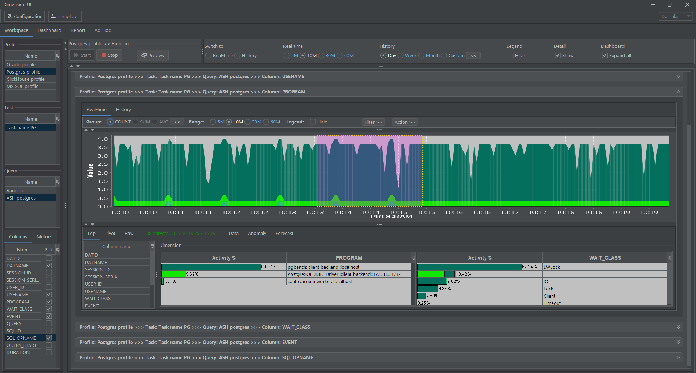
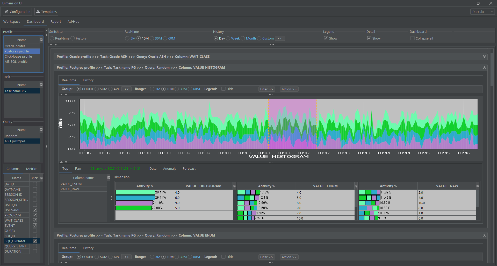
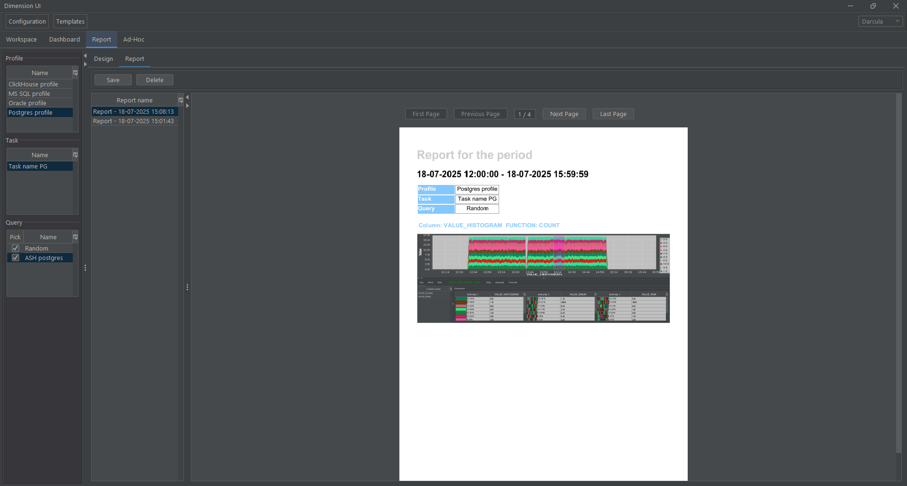
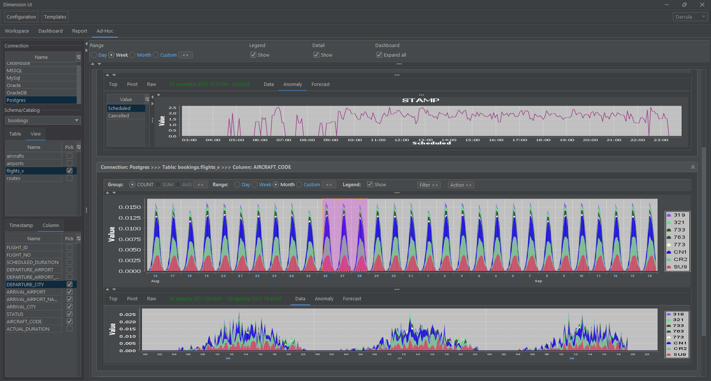
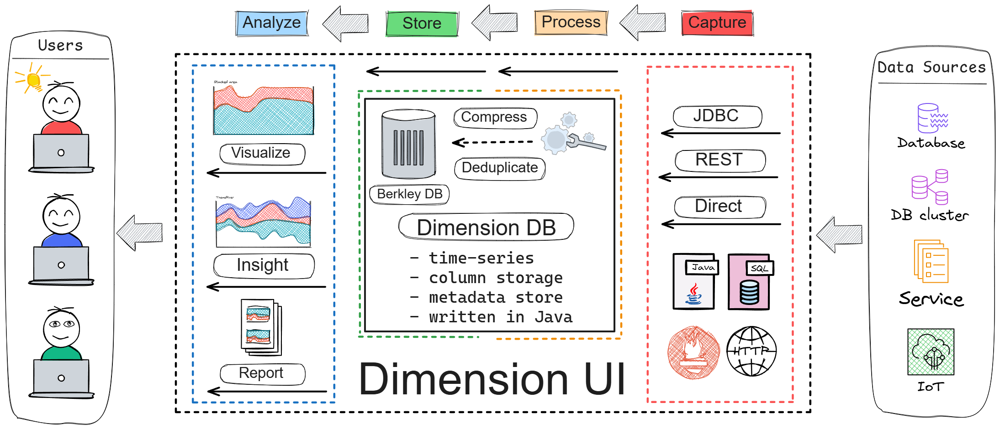
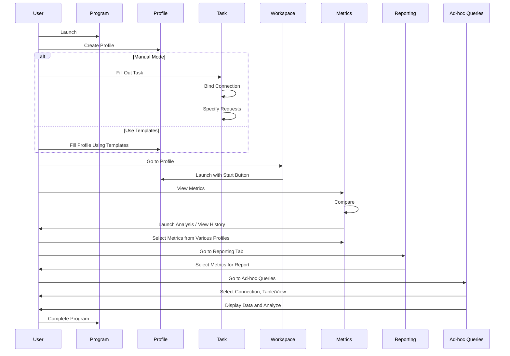

# Dimension UI

## Contents

- [Program description](#program-description)
  - [General information](#general-information)
  - [Application Areas](#application-areas)
  - [Minimum technical requirements](#minimum-technical-requirements)
  - [Getting started with the project](#getting-started-with-the-project)
    - [Building the Project](#building-the-project)
    - [Installation and configuration](#installation-and-configuration)
  - [Logical structure description](#description-of-the-logical-structure)
    - [Application architecture](#application-architecture)
    - [Algorithms](#algorithms)
      - [Z-normalized Euclidean distance](#z-normalized-Euclidean-distance)
    - [Program API](#program-api)
      - [Used methods](#methods-used)
      - [Input parameters](#input-parameters)
      - [Output parameters](#output-parameters)
    - [GUI](#gui)
      - [GUI sequence diagram](#gui-sequence-diagram)
      - [Configuration management](#configuration-management)
      - [Workspace Interface](#workspace-interface)
      - [Dashboard Interface](#dashboard-interface)
      - [Report Interface](#report-interface)
      - [Ad-hoc Interface](#ad-hoc-interface)
      - [Screencast](#screencast)
    - [Code use cases](#code-use-cases)
      - [Install LaF theme on application startup](#install-laf-theme-on-application-startup)
- [Download](#download)
- [Development](#development)
  - [CI/CD](#cicd)
- [Documentation](#documentation)
- [License](#license)
- [Contact](#contact)

## Program Description
**Dimension UI** is a desktop application designed to collect, store, visualize and analyze time series data.






### General Information

Key Features of **Dimension UI**:
- **Real-time data collection and analysis**: Data is collected in real time, enabling users to monitor metrics online, analyze responses to various types of impacts, review historical data, and perform comparative analysis with other indicators.
- **Flexible and rapid configuration of data collection profiles**: This feature is particularly useful when speed is critical, allowing users to quickly gather specialized statistical data for a more detailed evaluation of system or component characteristics.
- **Local storage in the specialized **Dimension DB** database** (project repositories on [**GitFlic**](https://gitflic.ru/project/akardapolov/dimension-db) and [**GitHub**](https://github.com/akardapolov/dimension-db))—a block-columnar database with built-in data compression and deduplication.
- **Advanced time-series data mining capabilities** using [Matrix Profile](https://www.cs.ucr.edu/~eamonn/MatrixProfile.html) and ARIMA.
- **Time-series data visualization** from external databases via JDBC with automatic SQL query generation for data sources (No-code mode).
- **Dashboard system** for displaying metrics from multiple sources in a single interface. Quick access to metrics simplifies user workflows when reviewing large volumes of analytical data.
- **Built-in reporting system** for generating PDF reports based on collected data for further analysis.

[Return to Contents](#Contents)

### Application Areas
1. Monitoring information systems, hardware and software systems, and databases in real time;
2. Evaluation of hardware and software systems during load and stress testing, preparation of reports based on testing results;
3. Monitoring the parameters of the Internet of Things (IoT) devices;
4. Solving the problems of complex monitoring of information security of systems with access to data sources via the JDBC and HTTP API (Prometheus, JSON);
5. Using the application for training in courses related to data processing and analysis, which require quick setup of data collection from test systems, visualization with the ability to perform advanced data analysis to demonstrate certain concepts, for example, for training system administrators, database administrators, developers and analysts;
6. Diagnostics of problems in the operation of complex systems providing APIs for access to monitoring data via JDBC and HTTP (Prometheus, JSON). For example, for detailed diagnostics of the operation of systems and their components in a heterogeneous environment, Java microservices working with a database;
7. Visualization and multidimensional analysis of collected time series data in a local database in real time, historically, and predictive analytics for various types of applications via JDBC and HTTP (Prometheus, JSON);
8. Visualization and multidimensional analysis of time series data for tables and views in external Postgres, Oracle, Microsoft SQL Server, ClickHouse databases via JDBC protocol without writing SQL (No-code mode);

[Return to Contents](#Contents)

## Minimum technical requirements
**Dimension DB** is compatible with Java 21+ and comes with a small set of dependencies.

### Hardware requirements

Table 1. Hardware requirements

| Parameter        | Description                                                                                                                        |
|:-----------------|:-----------------------------------------------------------------------------------------------------------------------------------|
| CPU and RAM      | Processor with a frequency of at least 500 MHz and a memory capacity of at least 250 MB, depending on the volume of processed data |
| CPU architecture | Intel 64-bit (x86_64), AMD 64-bit (x86_64), Arm 64-bit (aarch64)                                                                   |
| Disk             | Disk size depending on the volume of processed data                                                                                |

### Software requirements

Table 2. Software requirements

| Software | Requirements             |
|:---------|:-------------------------|
| Java     | Java version 21+         |
| Maven    | Not lower than version 3 |
| Git      | Latest current version   |
| DBase    | Latest current version   |

### Operating system requirements

Table 3. Operating system requirements

| Software         | Requirements          |
|:-----------------|:----------------------|
| Operating system | Windows, Linux, MacOS |

[Return to Contents](#contents)

### Getting started with the project

## Building the Project

To compile the application into an executable jar file, do the following:

1. Install JDK version 17 or higher, Maven and Git on your local computer:
    ```shell
    java -version  
    mvn -version
    git --version 
    ``` 
2. Download the source codes of the application to your local computer using Git:

    ```shell
    git clone <url>
    cd dimension-ui
    ```

3. Compile the project using Maven:
    ```shell
    mvn clean compile
   ```

4. Execute the Maven command to build an executable jar file with tests running:
    ```shell
     mvn clean package
    ```

[Return to Contents](#contents)

## Installation and configuration

- Windows Platform, run.bat
    ```shell
    SET JAVA_HOME=C:\PROGRAM FILES\JAVA\jdk-17  
    SET JAVA_EXE="%JAVA_HOME%\bin\java.exe"
    chcp 65001
  
    %JAVA_EXE% -Xmx1024m -DtestMode=false -Dfile.encoding=UTF8 -jar desktop-1.0-SNAPSHOT-jar-with-dependencies.jar
    ```
- Linux platform, run.sh
  ```shell
    #!/bin/bash
  
    export JAVA_HOME=/usr/lib/jvm/java-17-openjdk-amd64
    export JAVA_EXE=$JAVA_HOME/bin/java
    export LANG=en_US.UTF-8

    $JAVA_EXE -Xmx1024m -DtestMode=false -Dfile.encoding=UTF8 -jar desktop-1.0-SNAPSHOT-jar-with-dependencies.jar
  ```

To start working with the application you need to run the executable file **run.bat/run.sh**

[Return to Contents](#contents)

### Description of the logical structure

#### Application Architecture



[Back to Contents](#Contents)

#### Algorithms
The application interface provides the ability to analyze time series data in terms of anomaly detection, motif discovery, and forecasting;

For anomaly detection and motif discovery, the [Matrix profile](https://www.cs.ucr.edu/~eamonn/MatrixProfile.html) algorithm family is used, which uses the [Z-normalized Euclidean distance](#z-normalized-euclidean-distance) to compare time series ranges.

##### Z-normalized Euclidean distance
Euclidean distance is a way of measuring the distance between two points in space, which can be represented as a straight line between these two points. In the context of data, this helps us understand how close two data sets or two point features are to each other.

"Z-normalization" is a standardization process, and its goal is to transform all of our data so that the mean is 0 and the standard deviation is 1. It's like translating all data into a common language, so that any values ​​can be easily compared, without being affected by the scale or spread of the original values.

When we put this together, the Z-normalized Euclidean distance allows us to compare the Euclidean distance between data sets that have been normalized to a standard form. This way, we can be sure that we are comparing a distance that is independent of the original scales of the data.

This distance is often used in machine learning and statistics, for example for time series analysis or data clustering, where it is important to compare the "shape" of the data rather than the "size".

[Back to Contents](#Contents)

#### Program API
The Dimension UI program API provides an interface for loading data through JDBC and HTTP, visualizing it, and performing analysis.

##### Methods Used

| Method              | Description                                                                                                  | GUI                                                                  |
|---------------------|--------------------------------------------------------------------------------------------------------------|----------------------------------------------------------------------|
| **JDBC Connection** | Connecting to databases (PostgreSQL, Oracle, etc.) to collect data.                                          | [🔍 Preview](docs/guides/user/media/config/connection.png)           |
| **HTTP Requests**   | Requesting data through APIs (Prometheus) to collect metrics.                                                | [🔍 Preview](docs/guides/user/media/config/connection-http.png)      |
| **Data Analysis**   | Applying algorithms (Matrix Profile, ARIMA) to detect anomalies, patterns in data, and predictive analytics. | [🔍 Preview](docs/guides/user/media/workspace/workspace-analyze.png) |
| **Visualization**   | Generating charts and graphs based on retrieved data.                                                        | [🔍 Preview](docs/guides/user/media/workspace/workspace-data.png)    |

##### Input Parameters

| Parameter            | Description                                                                                                    | GUI                                                                 |
|----------------------|----------------------------------------------------------------------------------------------------------------|---------------------------------------------------------------------|
| **JDBC URL**         | Database connection string (e.g., `jdbc:postgresql://localhost:5432/mydb`)                                     | [🔍 Preview](docs/guides/user/media/config/connection.png)          |
| **HTTP Endpoint**    | Prometheus API URL (e.g., `http://localhost:9090/api/v1/query`)                                                | [🔍 Preview](docs/guides/user/media/config/connection-http.png)     |
| **SQL Query**        | Table name, SQL query, or metric name (e.g., `cpu_usage`)                                                      | [🔍 Preview](docs/guides/user/media/config/query-main.png)          |
| **Table Column**     | Table column for data visualization, grouping type, chart format                                               | [🔍 Preview](docs/guides/user/media/workspace/workspace-column.png) |
| **Time Range**       | Data interval for analysis (start/end date)                                                                    | [🔍 Preview](docs/guides/user/media/workspace/workspace-range.png)  |

##### Output Parameters

| Parameter             | Description                                                   | GUI                                                                              |
|-----------------------|---------------------------------------------------------------|----------------------------------------------------------------------------------|
| **Stacked Chart**     | Time series chart with multiple metrics (strings and numbers) | [🔍 Preview](docs/guides/user/media/workspace/workspace-stacked.png)             |
| **Linear Chart**      | Time series chart for displaying numerical data only          | [🔍 Preview](docs/guides/user/media/workspace/workspace-linear.png)              |
| **Gantt Chart**       | Gantt charts for visualizing data distribution                | [🔍 Preview](docs/guides/user/media/workspace/workspace-stacked-gantt.png)       |
| **Gantt Pivot Chart** | Pivot tables visualized using Gantt charts                    | [🔍 Preview](docs/guides/user/media/workspace/workspace-stacked-gantt-pivot.png) |
| **Data Tables**       | Data representation in tabular format                         | [🔍 Preview](docs/guides/user/media/workspace/workspace-stacked-raw.png)         |
| **Anomalies**         | Chart of detected anomalies and patterns in data              | [🔍 Preview](docs/guides/user/media/workspace/workspace-analyze-anomaly.png)     |
| **Forecast**          | Predictive analytics based on data                            | [🔍 Preview](docs/guides/user/media/workspace/workspace-analyze-forecast.png)    |
| **Report**            | Data visualizations as PDF reports                            | [🔍 Preview](docs/guides/user/media/report/report.png)                           |

[Back to Contents](#Contents)

#### GUI

##### GUI sequence diagram



##### Configuration Management
- **Editing and Viewing**: The interface provides capabilities for viewing and editing profiles and tasks, simplifying the management of complex configurations.
- **Data Collection**: Users can easily set data collection parameters through intuitive forms, where they can select data sources and configure query parameters.
- **Storage Settings**: The GUI allows configuring local data storage settings. The software enables selecting storage formats and compression options, optimizing disk space usage.
- **Template System**: The GUI lets users quickly create profiles based on existing templates, reducing setup time and accelerating system onboarding.

[🔍 Preview](docs/guides/user/media/workspace/workspace-stacked.png)
[🔍 Preview](docs/guides/user/media/config/profile.png)  
[🔍 Preview](docs/guides/user/media/config/task.png)  
[🔍 Preview](docs/guides/user/media/config/connection.png)  
[🔍 Preview](docs/guides/user/media/config/query-main.png)  
[🔍 Preview](docs/guides/user/media/config/query-metadata.png)  
[🔍 Preview](docs/guides/user/media/config/query-metrics.png)  
[🔍 Preview](docs/guides/user/media/template/template.png)  

[Back to Contents](#Contents)

##### Workspace Interface
- **Data Representation**: The interface enables seamless data interaction through visual elements, allowing users to explore local database content via various graphical representations.
- **Visualization Tools**: The GUI supports multiple visualization types, such as stacked and linear time-series charts, Gantt diagrams, and tabular data views, enhancing data analysis.
- **Data Analysis Interface**: Users can perform advanced time-series analysis using algorithms like [Matrix Profile](https://www.cs.ucr.edu/~eamonn/MatrixProfile.html), visualizing results to highlight anomalies or trends.

[🔍 Preview](docs/guides/user/media/workspace/workspace-stacked.png)  
[🔍 Preview](docs/guides/user/media/workspace/workspace-linear.png)  
[🔍 Preview](docs/guides/user/media/workspace/workspace-analyze-anomaly.png)  
[🔍 Preview](docs/guides/user/media/workspace/workspace-analyze-forecast.png)  

[Back to Contents](#Contents)

##### Dashboard Interface
- **Control Panel**: Allows users to create and customize dashboards for real-time metric display, providing quick access to critical data.

[🔍 Preview](docs/guides/user/media/dashboard/dashboard-short.png)  
[🔍 Preview](docs/guides/user/media/dashboard/dashboard-full.png)  

[Back to Contents](#Contents)

##### Report Interface
- **Report Design Tools**: The GUI enables configuring report generation interfaces. Users can select data, format, and layout to create export-ready PDF reports.

[🔍 Preview](docs/guides/user/media/report/report.png)  
[🔍 Preview](docs/guides/user/media/report/design.png)  

[Back to Contents](#Contents)

##### Ad-hoc Interface
- **External Database Visualization**: The GUI lets users quickly access time-series data directly from external systems via JDBC.
- **No-code Approach**: Visualize time-series data using auto-generated SQL queries to data sources (working with denormalized data schema).

[🔍 Preview](docs/guides/user/media/adhoc/ad-hoc-visualize.png)  
[🔍 Preview](docs/guides/user/media/adhoc/ad-hoc-analyze.png)  

[Back to Contents](#Contents)

## Screencast

|               | Screencast                                                          |
|:--------------|:--------------------------------------------------------------------|
| Configuration | [🔍 Configuration](docs/guides/user/media/config/configuration.gif) |
| Workspace     | [🔍 Workspace](docs/guides/user/media/workspace/workspace.gif)      |
| Dashboard     | [🔍 Dashboard](docs/guides/user/media/dashboard/dashboard.gif)      |
| Report        | [🔍 Report](docs/guides/user/media/report/report.gif)               |
| Ad-hoc        | [🔍 Ad-hoc](docs/guides/user/media/adhoc/adhoc.gif)                 |

[Back to Contents](#Contents)

### Code Use Cases

#### Install LaF theme on application startup

To set the application theme, you must use the LaF parameter in the Java Virtual Machine settings (VM options). This allows you to choose between dark, light, or default themes.

Supported parameters:

- -DLaF=dark — to set the dark theme.
- -DLaF=light — to set the light theme.
- -DLaF=default — to use the default theme.

When running the application via the command line, the LaF parameter is specified as follows:

```shell
%JAVA_EXE% -Xmx1024m -DLaF=dark -Dfile.encoding=UTF8 -jar desktop-1.0-SNAPSHOT-jar-with-dependencies.jar
```

For more details, see the [Installation and Configuration](#installation-and-configuration) section

## Download
- Building and installing DBase from source codes to a local Maven repository is described in the [Building the Project](#building-the-project) section.

[Back to Contents](#Contents)

## Development
- If you find an error in the code or have suggestions for improvement, create a ticket;
- Before starting work, you need to check the project build and successful completion of unit tests according to the instructions in the [Project build](#building-the-project) section;

### CI/CD

To use CI/CD use Gitea Actions:

1. Install gitea 1.20 using [Docker](https://docs.gitea.com/next/installation/install-with-docker);
2. Add additional configurations in app.ini to enable [Actions](https://blog.gitea.io/2022/12/feature-preview-gitea-actions/);
3. Install gitea [runner](https://gitea.com/gitea/act_runner) follow this [guide](https://blog.gitea.io/2022/12/feature-preview-gitea-actions/);
4. Use [Docker compose file](docs/docker/docker-compose.yml);
5. Create pipeline in [build.yaml](.gitea/workflows/build.yaml).

[Return to Contents](#contents)

## Documentation

| EN                                              | RU                                                            |
|:------------------------------------------------|:--------------------------------------------------------------|
| [README in English](README.md)                  | [README на русском](README-RU.md)                             |
| [User guide](docs/guides/user/user-guide-en.md) | [Руководство пользователя](docs/guides/user/user-guide-ru.md) |

[Return to Contents](#contents)

## License

[](https://opensource.org/licenses/Apache-2.0)
Code released under the Apache License Version 2.0

[Return to Contents](#contents)

## Support

Created with support of ["Innovation Promotion Fund"](https://fasie.ru/).

[Return to Contents](#contents)

## Contact
Created by [@akardapolov](mailto:akardapolov@yandex.ru)

[Return to Contents](#contents)