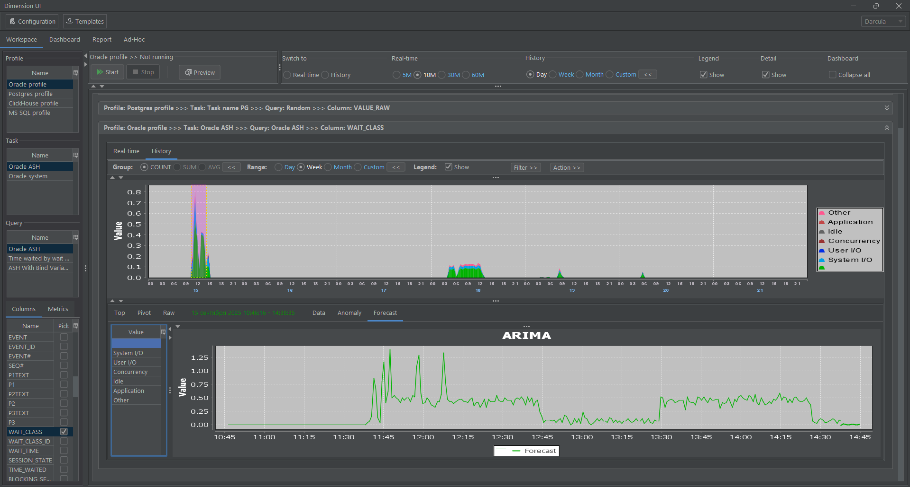
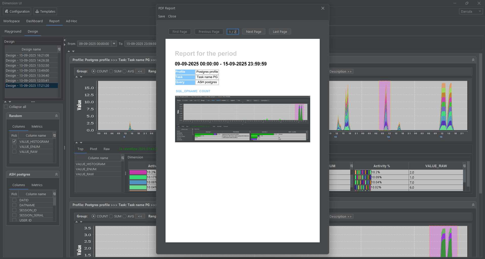
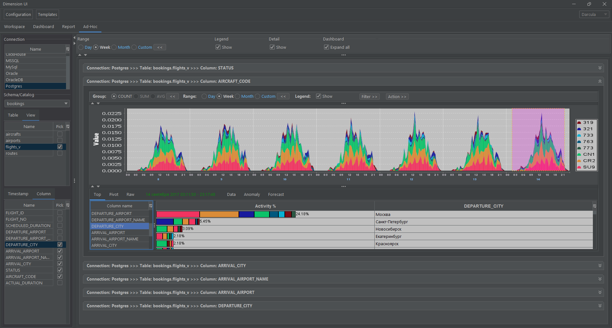

# Dimension UI

## Contents

- [Program description](#program-description)
    - [General information](#general-information)
    - [Application Areas](#application-areas)
    - [Minimum technical requirements](#minimum-technical-requirements)
    - [Getting started with the project](#getting-started-with-the-project)
        - [Building the Project](#building-the-project)
        - [Installation and configuration](#installation-and-configuration)
- [Configuration management](#configuration-management)
- [Data collection](#data-collection)
- [Data storage](#data-storage)
- [Templates for data collection](#templates-for-data-collection)
- [Data visualization](#data-visualization)
- [Data analysis](#data-analysis)
- [Reporting system](#reporting-system)
- [Specialised Ad-hoc data queries](#specialised-ad-hoc-data-queries)
- [Algorithm](#algorithm)
- [Application areas](#application-areas)
- [Screencast](#screencast)
- [Support](#support)

## Program Description
**Dimension UI** is a desktop application designed to collect, store, visualize and analyze time series data.

### General Information

Key Features of **Dimension UI**:
- **Real-time data collection and analysis**: Data is collected in real time, enabling users to monitor metrics online, analyze responses to various types of impacts, review historical data, and perform comparative analysis with other indicators.
- **Flexible and rapid configuration of data collection profiles**: This feature is particularly useful when speed is critical, allowing users to quickly gather specialized statistical data for a more detailed evaluation of system or component characteristics.
- **Local storage in the specialized **Dimension DB** database** (project repositories on [**GitFlic**](https://gitflic.ru/project/akardapolov/dimension-db) and [**GitHub**](https://github.com/akardapolov/dimension-db))—a block-columnar database with built-in data compression and deduplication.
- **Advanced time-series data mining capabilities** using [Matrix Profile](https://www.cs.ucr.edu/~eamonn/MatrixProfile.html) and ARIMA.
- **Time-series data visualization** from external databases via JDBC with automatic SQL query generation for data sources (No-code mode).
- **Dashboard system** for displaying metrics from multiple sources in a single interface. Quick access to metrics simplifies user workflows when reviewing large volumes of analytical data.
- **Built-in reporting system** for generating PDF reports based on collected data for further analysis.

[Return to Contents](#Contents)

### Application Areas
1. Monitoring information systems, hardware and software systems, and databases in real time;
2. Evaluation of hardware and software systems during load and stress testing, preparation of reports based on testing results;
3. Monitoring the parameters of the Internet of Things (IoT) devices;
4. Solving the problems of complex monitoring of information security of systems with access to data sources via the JDBC and HTTP API (Prometheus, JSON);
5. Using the application for training in courses related to data processing and analysis, which require quick setup of data collection from test systems, visualization with the ability to perform advanced data analysis to demonstrate certain concepts, for example, for training system administrators, database administrators, developers and analysts;
6. Diagnostics of problems in the operation of complex systems providing APIs for access to monitoring data via JDBC and HTTP (Prometheus, JSON). For example, for detailed diagnostics of the operation of systems and their components in a heterogeneous environment, Java microservices working with a database;
7. Visualization and multidimensional analysis of collected time series data in a local database in real time, historically, and predictive analytics for various types of applications via JDBC and HTTP (Prometheus, JSON);
8. Visualization and multidimensional analysis of time series data for tables and views in external Postgres, Oracle, Microsoft SQL Server, ClickHouse databases via JDBC protocol without writing SQL (No-code mode);

[Return to Contents](#Contents)

## Minimum technical requirements
**Dimension DB** is compatible with Java 25+ and comes with a small set of dependencies.

### Hardware requirements

Table 1. Hardware requirements

| Parameter        | Description                                                                                                                        |
|:-----------------|:-----------------------------------------------------------------------------------------------------------------------------------|
| CPU and RAM      | Processor with a frequency of at least 500 MHz and a memory capacity of at least 250 MB, depending on the volume of processed data |
| CPU architecture | Intel 64-bit (x86_64), AMD 64-bit (x86_64), Arm 64-bit (aarch64)                                                                   |
| Disk             | Disk size depending on the volume of processed data                                                                                |

### Software requirements

Table 2. Software requirements

| Software | Requirements             |
|:---------|:-------------------------|
| Java     | Java version 24+         |
| Maven    | Not lower than version 3 |
| Git      | Latest current version   |
| DBase    | Latest current version   |

### Operating system requirements

Table 3. Operating system requirements

| Software         | Requirements          |
|:-----------------|:----------------------|
| Operating system | Windows, Linux, MacOS |

[Return to Contents](#contents)

### Getting started with the project

## Building the Project

To compile the application into an executable jar file, do the following:

1. Install JDK version 17 or higher, Maven and Git on your local computer:
    ```shell
    java -version  
    mvn -version
    git --version 
    ``` 
2. Download the source codes of the application to your local computer using Git:

    ```shell
    git clone <url>
    cd dimension-ui
    ```

3. Compile the project using Maven:
    ```shell
    mvn clean compile
   ```

4. Execute the Maven command to build an executable jar file with tests running:
    ```shell
     mvn clean package
    ```

[Return to Contents](#contents)

## Installation and configuration

- Windows Platform, run.bat
    ```shell
    SET JAVA_HOME=C:\PROGRAM FILES\JAVA\jdk-24  
    SET JAVA_EXE="%JAVA_HOME%\bin\java.exe"
    chcp 65001
  
    %JAVA_EXE% -Xmx1024m -DtestMode=false -Dfile.encoding=UTF8 -jar desktop-1.0-SNAPSHOT-jar-with-dependencies.jar
    ```
- Linux platform, run.sh
  ```shell
    #!/bin/bash
  
    export JAVA_HOME=/usr/lib/jvm/java-24-openjdk-amd64
    export JAVA_EXE=$JAVA_HOME/bin/java
    export LANG=en_US.UTF-8

    $JAVA_EXE -Xmx1024m -DtestMode=false -Dfile.encoding=UTF8 -jar desktop-1.0-SNAPSHOT-jar-with-dependencies.jar
  ```

To start working with the application you need to run the executable file **run.bat/run.sh**

[Return to Contents](#contents)

## Configuration management

The configuration of **Dimension UI** application consists of several main entities including **Profile**, **Task**, **Connection** and **Request**.

- A **Profile** is a repository of information about a particular profile, including its name, a brief description and list of tasks to be performed when you start this profile.


- **Task**, in turn, is an entity that contains a list of queries that must be executed within this task. Each task also contains the name of the request, a brief description, the connection and the frequency of queries to the remote system.


- **Connection** is an entity that contains all the necessary information about the details of the connection to the remote JDBC system. Connection attributes: name, URL, username, password, as well as file location information and class name JDBC Driver class.


- **Queries** are textual descriptions of SQL queries that are sent to the server to retrieve data. Each query also contains information about the name of the query, a short description, the way of filling the data (locally or on the server)  and data loading mode (direct, JDBC in real time, batch data loading from JDBC source).


Methods of filling data:

- Locally, when we load data directly from a remote system into the local database;
- On server, when data are filled by separate process, and we only load them locally.

Inside the query interface there are also metadata entities for the local database table and metrics.

- **Metadata** contains information about the table configuration in the local DBase engine data repository according to the query data. Table metadata: name, storage type (regular table or table for storing time series data), indexing type (local or global), data compression, table column for time tracking, metadata of table columns.  The interface also displays the connection to the job data source in which the query is executed. This is needed in order to load metadata on the query into the local storage.


- **Metrics** is an entity for displaying specially prepared statistics.
  Attributes of metrics: name, X axis (column name), Y axis (column name), grouping of data (by column), function (way of processing of displayed data), way of graphical data displaying (linear, stacked graphs), default value (when displaying detail data for stacked plots). At the bottom there is a list of all the metrics for the given query are displayed at the bottom.


There are two modes available in the application interface: **View** and **Edit** data.

- In the **View** mode the data is displayed taking into account the hierarchical structure that is formed on the basis of the profiles. Each profile can contain several tasks, each of which can include several queries.  Each job is linked to a single connection, which allows you to perform multiple queries to the same data source.


- In the **Edit** mode the user has the ability to create new objects, copy, delete and modify existing ones.


The application has functionality that allows you to create a profile using pre-created job templates, connections and requests, which are available in the interface **Settings** and **Templates**.

[Return to Table of Contents](#contents)

## Data collection

The application collects data from remote systems via the JDBC protocol, HTTP (Prometheus) or directly from the application. All data sources for which an appropriate JDBC driver is developed.

The logic for obtaining time series data depends on where the data is collected.

1. If the table data from the remote system is filled on the server, we choose the option **Collect data on the server** - set **Gather data sql** to **BY_SERVER_JDBC** value. The application tracks the pointer to the timestamp of the last selected record, then loads the data into the local database, that were added on the remote system.
2. The **Collect data on the client** option allows you to collect data from the remote system and store it locally, the timestamps are tracked by the application.  Set **Gather data sql** to **BY_CLIENT_JDBC** value or **BY_CLIENT_HTTP** for Prometheus.

The timestamps are tracked by a column with the data type **Timestamp**, which is defined in the settings by table. In the configuration interface, this setting is located in **Queries** -> **Metadata** -> **Timestamp drop-down list**.

[Return to Table of Contents](#contents)

## Data storage

Data storage in the application is implemented with the use of a specialized storage system of block-column type with compression **Dimension DB** (repositories [**GitFlic**](https://gitflic.ru/project/akardapolov/dimension-db) and [**GitHub**](https://github.com/akardapolov/dimension-db)).

DB settings are located in the **Queries** -> **Metadata** interface. The usual tables are supported and tables for storing time series data. Three types of column data storage are available: RAW, ENUM and HISTOGRAM. The types of column data storage types are determined in the settings at the table or block level (the **Global** or **Local** indexing setting). Local indexing on the block level is a function for automatically selecting the appropriate storage type for the block  based on data distribution. The storage type selection in this option is automatic. Data compression is supported. Settings for data compression and storage type selection are made dynamically.

[Return to Table of Contents](#contents)

## Templates for data collection

The **Templates** interface displays template settings: list of templates by profiles, queries and connections.


By clicking on the **Load** button, it is possible to load data on the selected profile, connection and query template into a separate profile, for which its name and description are specified


Template integration is also built into the application's settings storage and selection system. Interface elements (**Templates tab**, and the **List of templates**)


[Return to Table of Contents](#contents)

## Data visualization

The application supports several ways to display data:

### **Workspace** Interface

* In real-time mode, data is visualized as it arrives. To display data in this mode, select the appropriate metric or query column in the **Real-time** interface. In the **Details** interface, you can choose **Count**, **Sum**, or **Average** functions. For numeric values, any of these functions can be selected; for string data, sum and average calculations are not available.


* In historical view, data is displayed for a previous observation period. To do this, select a metric or query column and specify a range in the **History** interface; when selecting the **Custom** field, a more detailed range selection is possible.


* Display of multidimensional data as a **Pivot** summary report with support for row and column totals.


### **Dashboard** Interface

In the **Dashboard** interface, data can be displayed in real-time while simultaneously tracking several selected metrics and columns from different profiles.


If you need to view detailed information for a selected dimension, clicking the **Details** button will open an extended statistics window with history viewing capability.


[Return to Table of Contents](#contents)

## Data analysis

Data analysis functionality is available in detail when a range is selected.

By selecting a specific range, you can get the top related indicators for all other dimensions (for numeric data) and then obtain a real-time updating graph with the selected filter:


For history, the display logic is similar, except that the data is not updated; only the selected ranges are shown.


You can hide data by indicators in the legend, which is convenient when dimension indicator names are long.

For data analysis, the graph for each selected dimension is divided into blocks: **Data**, **Anomaly**, and **Forecast**. The **Data** block displays graphs of collected data for the selected range; **Anomaly** and **Forecast** show data analysis results using connected **Matrix Profile** algorithms and the **Smile** algorithm library as graphs. This interface view is displayed for each selected dimension.

For the **Anomaly** block, available algorithms are shown at the top of the interface (in the screenshot, this is **STAMP**); on the left, all available dimension indicators are displayed. When a value is selected from the list, the user gets a **Matrix Profile** calculation graph, where *maxima* at the top of the graph are *anomalies in the data*, and *minima* at the bottom are *repeated values in the indicators*.

For the **Forecast** block, available algorithms are also shown at the top of the interface (in the screenshot, this is **ARIMA**); on the left, all available dimension indicators are displayed. When a value is selected from the list, the user gets a graph with data and forecast continuation values (dashed line).




For each selected algorithm (for **Anomaly** and **Forecast**), you can manage its settings via the **Settings** form.

 

[Return to Table of Contents](#contents)

## Reporting system

The application has a feature to create reports in PDF format.

### Report Parameter Configuration

To configure report parameters, select the appropriate profile, job, and query, then choose a metric or query column in the **Playground** interface and save the design profile.


On the **Design** tab, select the saved profile, choose the required ranges, and create a report by clicking the **Report** button.

After the future report layout is displayed, you can edit the description, select any of the **Count**, **Sum**, or **Average** functions, arbitrary date ranges, hide the legend, and enable filtering.


### Report generation

After the user has configured all necessary report parameters, they start the report generation process via the **Report** button.

### Viewing the report

The created PDF report is displayed on the **Report** tab, which is intended for report viewing. The report contains all data from the layout: graphs, tables, and comments.



### Exporting a report

The user is given the opportunity to export the report in PDF format. To do this, use the **Save** button to select the directory to save the report file.

[Return to Table of Contents](#contents)

## Specialised Ad-hoc data queries

In the **Ad-Hoc** interface in the left part the list of **JDBC** connections is displayed, by clicking on the connection the information on tables and views used in different database schemes and catalogues is automatically collected, by clicking on each table in the upper part the interface is filled in which the metadata on the table (metrics names, data types for storing temporary metrics) is displayed. By selecting a metric and a column for storing time metrics, you can get a graph of the function for the given query as a result. It is possible to specify a date range (last day, week month or any date range on **Custom**).

By selecting the data range on the **Stacked** graph, the detail is displayed in the form of **Gantt** and **Pivot** graphs for the selected dependent main metric



[Return to Table of Contents](#contents)

## Algorithm

[Return to Table of Contents](#contents)

## Application areas
1. monitoring of information systems, software and hardware systems and databases in real time;
2. assessment of the operation of software and hardware systems during load and stress testing, preparation of reports on testing results;
3. monitoring the parameters of Internet of things (IoT) devices;
4. solving problems of comprehensive monitoring of information security of systems with access to data sources via JDBC and HTTP API (Prometheus, JSON);
5. use of the application for training in courses related to data processing and analysis, which require quick setup of data collection from test systems, visualization with the possibility of advanced data analysis to demonstrate certain concepts, for example, for training system administrators, database administrators, developers and analysts;
6. diagnosing problems in the operation of complex systems that provide APIs for accessing monitoring data via JDBC and HTTP (Prometheus, JSON). For example, for detailed diagnostics of the operation of systems and their components in a heterogeneous environment, microservices in Java working with a database;
7. visualization and multidimensional analysis of collected time series data in a local database in real time, historical context and predictive analytics for various types of applications via JDBC and HTTP (Prometheus, JSON);
8. visualization and multidimensional analysis of time series data for tables and views in external databases Postgres, Oracle, Microsoft SQL Server, ClickHouse via the JDBC protocol without writing SQL (No-code mode);

[Вернуться в оглавление](#содержание)

## Screencast

|               | Screencast                                                                   |
|:--------------|:-----------------------------------------------------------------------------|
| Configuration | <a href="media/config/configuration.gif"  target="_blank">Configuration </a> |
| Workspace     | <a href="media/workspace/workspace.gif"  target="_blank">Workspace </a>      |
| Dashboard     | <a href="media/dashboard/dashboard.gif"  target="_blank">Dashboard </a>      |
| Report        | <a href="media/report/report.gif"  target="_blank">Report </a>               |   
| Ad-hoc        | <a href="media/adhoc/adhoc.gif"  target="_blank">Ad-hoc </a>                 |   

[Return to Table of Contents](#contents)

## Support
Created with support of ["Innovation Promotion Fund"](https://fasie.ru/).

[Return to Table of Contents](#contents)

## Contact
[@akardapolov](mailto:akardapolov@yandex.ru)

[Return to Table of Contents](#contents)