# Dimension UI

## Содержание

- [Описание программы](#описание-программы)
    - [Общие сведения](#общие-сведения)
    - [Направления прикладного использования](#направления-прикладного-использования)
    - [Минимальные технические требования](#минимальные-технические-требования)
    - [Начало работы с проектом](#начало-работы-с-проектом)
        - [Сборка проекта](#сборка-проекта)
        - [Установка и настройка](#установка-и-настройка)
- [Управление конфигурацией](#управление-конфигурацией)
- [Сбор данных](#сбор-данных)
- [Хранение данных](#хранение-данных)
- [Шаблоны для сбора данных](#шаблоны-для-сбора-данных)
- [Визуализация данных](#визуализация-данных)
- [Анализ данных](#анализ-данных)
- [Система отчетов](#система-отчетов)
- [Специализированные запросы к данным Ad-hoc](#специализированные-запросы-к-данным-ad-hoc)
- [Алгоритм](#Алгоритм)
- [Screencast](#screencast)
- [Поддержка](#поддержка)

## Описание программы
**Dimension UI** - это настольное приложение, предназначенное для сбора, хранения, визуализации и анализа данных временных рядов.

### Общие сведения

Ключевые особенности **Dimension UI**:
- **Сбор и анализ данных в режиме реального времени**. Данные собираются в режиме реального времени, что позволяет пользователям отслеживать метрики в режиме онлайн, анализировать реакцию на различные виды воздействия, просматривать историю и проводить сравнительный анализ с другими показателями;
- **Гибкая и быстрая настройка профилей сбора данных**. Эта функция особенно полезна, когда скорость имеет первостепенное значение и пользователям необходимо быстро собрать специальные статистические данные для более детальной оценки характеристик системы или компонента;
- **Локальное хранение в специализированной БД **Dimension DB**** (репозитории проекта на [**GitFlic**](https://gitflic.ru/project/akardapolov/dimension-db) и [**GitHub**](https://github.com/akardapolov/dimension-db)) блочно-колоночного типа со встроенным сжатием данных и дедупликацией;
- **Продвинутые возможности по интеллектуальному анализу данных временных рядов** с использованием [Matrix profile](https://www.cs.ucr.edu/~eamonn/MatrixProfile.html) и ARIMA;
- **Визуализация данных временных рядов во внешних БД по JDBC** с использованием автоматической генерации SQL-запросов к источникам данных, режим No-code;
- **Система информационных панелей** для отображения метрик из разных источников в одном интерфейсе. Быстрый доступ к метрикам облегчает работу пользователей по просмотру больших объемов анализируемых данных;
- **Система создания отчетов** по собранным данным в формате PDF для последующего анализа.

[Вернуться в оглавление](#содержание)

### Направления прикладного использования
1. Мониторинг информационных систем, программно-аппаратных комплексов и баз данных в режиме реального времени;
2. Оценка работы программно-аппаратных комплексов в ходе нагрузочного и стресс-тестирования, подготовка отчетов по результатам тестирования;
3. Мониторинг параметров устройств "Интернета вещей" (англ. internet of things, IoT);
4. Решение задач комплексного мониторинга информационной безопасности систем с доступом к источникам данных по API JDBC и HTTP (Prometheus, JSON);
5. Использование приложения для обучения на курсах, связанных с обработкой и анализом данных, в которых требуется выполнять быструю настройку сбора данных с тестовых систем, визуализацию с возможностью продвинутого анализа данных для демонстрации тех или иных концепций, например для обучения системных администраторов, администраторов БД, разработчиков и аналитиков;
6. Диагностика проблем в работе комплексных систем предоставляющих API для доступа к данным мониторинга по JDBC и HTTP (Prometheus, JSON). Например, для детальной диагностики работы систем и их компонентов в гетерогенном окружении, микросервисы на Java работающие с БД;
7. Визуализация и многомерный анализ собранных данных временных рядов в локальной БД в режиме реального времени, историческом разрезе и предиктивная аналитика для различных типов приложений по JDBC и HTTP (Prometheus, JSON);
8. Визуализация и многомерный анализ данных временных рядов для таблиц и представлений во внешних базах данных Postgres, Oracle, Microsoft SQL Server, ClickHouse по протоколу JDBC без написания SQL (No-code режим);

[Вернуться в оглавление](#содержание)

## Минимальные технические требования
**Dimension UI** совместим с Java 21+ и поставляется с небольшим набором зависимостей.

### Требования к аппаратному обеспечению

Таблица 1. Требования к аппаратному обеспечению

| Параметр        | Описание                                                                                                        |
|:----------------|:----------------------------------------------------------------------------------------------------------------|
| CPU и ОЗУ       | Процессор частотой не ниже 500 МHz и объем памяти не ниже 250 Мб, в зависимости от объема обрабатываемых данных |
| Архитектура CPU | Intel 64-bit (x86_64), AMD 64-bit (x86_64), Arm 64-bit (aarch64)                                                |
| Диск            | Размер диска в зависимости от объема обрабатываемых данных                                                      |

### Требования к программному обеспечению

Таблица 2. Требования к программному обеспечению

| ПО    | Требования                  |
|:------|:----------------------------|
| Java  | Версия Java 21+             |
| Maven | Не ниже 3 версии            |
| Git   | Последняя актуальная версия |
| DBase | Последняя актуальная версия |

### Требования к операционному обеспечению

Таблица 3. Требования к операционному обеспечению

| ПО                   | Требования                  |
|:---------------------|:----------------------------|
| Операционная система | Windows, Linux, MacOS       |

[Вернуться в оглавление](#содержание)

### Начало работы с проектом

#### Сборка проекта

Для компиляции приложения в исполняемый jar-файл необходимо выполнить следующее:

1. Установить на локальный компьютер JDK не ниже 21 версии, Maven и Git.
    ```shell
    java -version  
    mvn -version
    git --version 
    ``` 

2. Загрузить исходные коды приложения БД **Dimension DB** [**GitFlic**](https://gitflic.ru/project/akardapolov/dimension-db) или [**GitHub**](https://github.com/akardapolov/dimension-db) на локальный компьютер с помощью Git и выполнить сборку и установку последней версии БД в локальный репозиторий Maven
    ```shell
    git clone <url системы хранения исходных кодов>
    cd fbase
    mvn clean compile
    mvn clean install
    ```

3. Загрузить исходные коды приложения на локальный компьютер с помощью Git
    ```shell
    git clone <url системы хранения исходных кодов>
    cd dimension-ui
    ```

4. Выполнить компиляцию проекта с помощью Maven
   ```shell
    mvn clean compile
   ```

5. Выполнить команду Maven для сборки исполняемого jar-файла с запуском тестов
    ```shell
     mvn clean package -DskipTests=false
    ```

Исполняемый jar-файл вида `desktop-<VERSION>-SNAPSHOT-jar-with-dependencies.jar` будет располагаться по относительному пути desktop/target

[Вернуться в оглавление](#содержание)

## Установка и настройка

1. Убедитесь, что на вашем компьютере установлена JDK версии 21 или выше. Подробная инструкция по установке для вашей платформы на сайте [oracle.com](https://www.oracle.com/java/technologies/downloads/)
2. Загрузите исполняемый jar-файл приложения с сайта github.com или выполните локальную сборку по инструкции из раздела [Сборка проекта](#сборка-проекта)
3. Создайте директорию для хранения конфигурации и локальной базы данных приложения.
4. Скопируйте jar-файл в директорию, в которой создайте исполняемый файл запуска:

- Платформа Windows, run.bat
    ```shell
    SET JAVA_HOME=C:\PROGRAM FILES\JAVA\jdk-21
    SET JAVA_EXE="%JAVA_HOME%\bin\java.exe"
    chcp 65001
    %JAVA_EXE% -Xmx1024m -DLaF=dark -Dfile.encoding=UTF8 -jar desktop-1.0-SNAPSHOT-jar-with-dependencies.jar
    ```
- Платформа Linux, run.sh
  ```shell
    SET JAVA_HOME=C:\PROGRAM FILES\JAVA\jdk-21
    SET JAVA_EXE="%JAVA_HOME%\bin\java.exe" 
    chcp 65001
    %JAVA_EXE% -Xmx1024m -DLaF=dark -Dfile.encoding=UTF8 -jar desktop-1.0-SNAPSHOT-jar-with-dependencies.jar
  ```

В строке **SET JAVA_HOME** необходимо прописать путь к директории где на вашем локальном компьютере установлен JDK

Для начала работы с приложением нужно запустить исполняемый файл **run.bat/run.sh**

[Вернуться в оглавление](#содержание)

## Управление конфигурацией

Конфигурация приложения **Dimension UI** состоит из нескольких основных сущностей, включая **Профиль**, **Задание**, **Подключение** и **Запрос**.

- **Профиль** представляет собой хранилище информации о конкретном профиле, включая его название, краткое описание и список заданий, которые должны быть выполнены при запуске данного профиля. <a href="media/config/profile.gif" target="_blank">Screencast  </a>

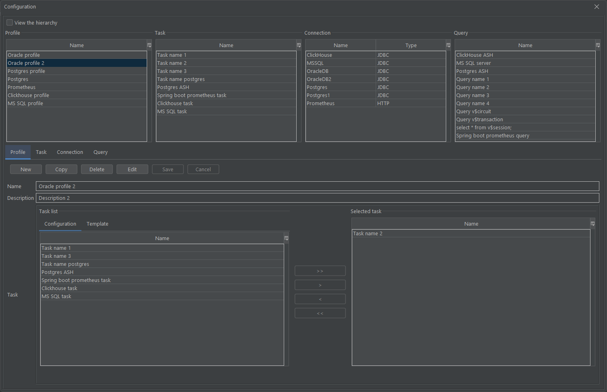

- **Задание**, в свою очередь, является сущностью, содержащей список запросов, которые должны быть выполнены в рамках данного задания. Каждое задание также содержит имя запроса, краткое описание, подключение и частота запросов к удаленной системе. <a href="media/config/task.gif" target="_blank">Screencast </a>

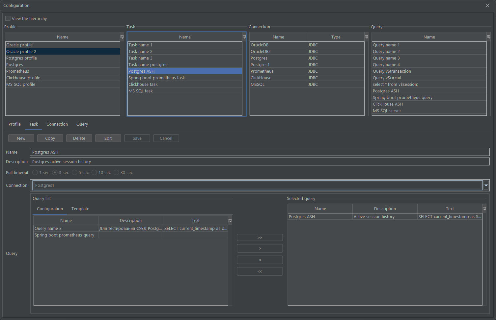

- **Подключение** - это сущность, содержащая всю необходимую информацию о деталях подключения к удаленной системе JDBC.
  Атрибуты подключения: имя, URL-адрес, имя пользователя, пароль, а также информацию о расположение файла и название класса JDBC Driver-а. <a href="media/config/connection.gif"  target="_blank">Screencast</a>

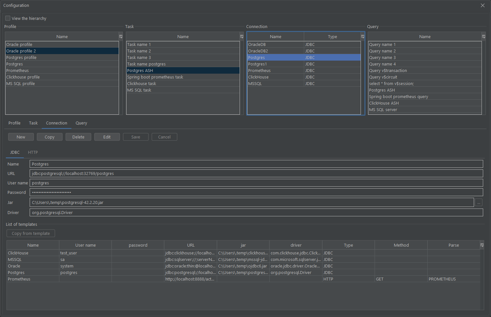

- **Запросы** представляют собой текстовые описания SQL-запросов, которые отправляются на сервер для получения данных.
  Каждый запрос также содержит информацию о названии запроса, краткое описание, способе наполнения данных (локально или на сервере) и режиме загрузки данных(прямой, JDBC в режиме реального времени, пакетная загрузка данных из JDBC источника).  <a href="media/config/query.gif"  target="_blank">Screencast </a>

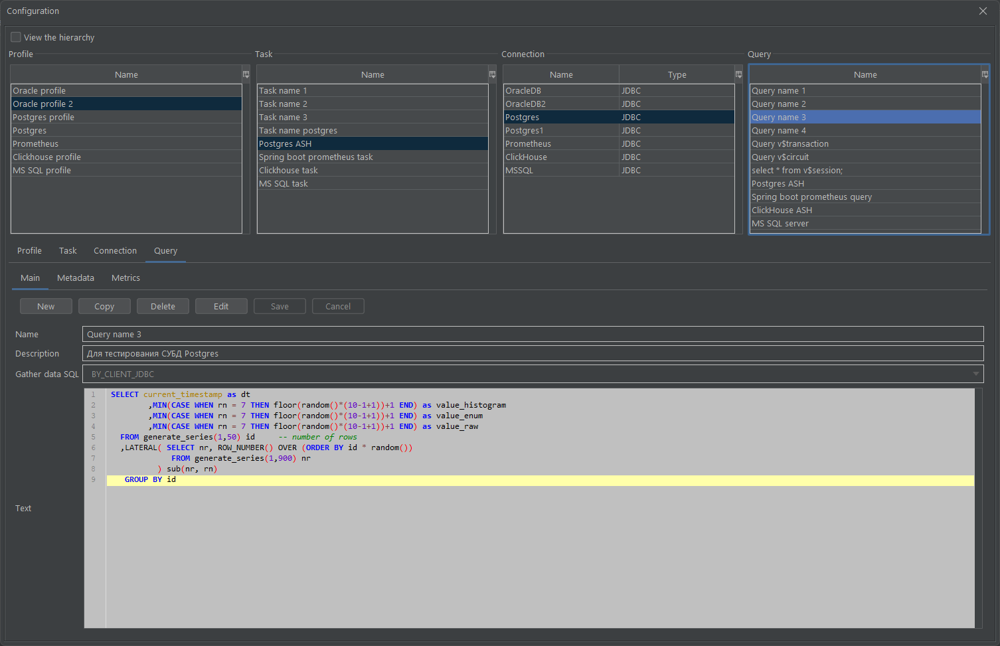

Способы наполнения данных:

- локально, когда мы загружаем данные напрямую из удаленной системы в локальную БД;
- на сервере, когда данные заполняются отдельным процессом и мы только подгружаем их локально.

Внутри интерфейса запроса также присутствуют сущности метаданные по таблице локальной БД и метрики.

- **Метаданные** содержат информацию о конфигурации таблицы в локальном хранилище данных движка DBase по данным запроса.
  Метаданные таблицы: имя, тип хранения(обычная таблица или таблица для хранения данных временных рядов), тип индексирования
  (локальный или глобальный), сжатие данных, столбец таблицы для отслеживания времени, метаданные столбцов таблицы.
  Также в интерфейсе отображается подключение к источнику данных задания в котором выполняется данный запрос. Это нужно для того, чтобы подгрузить метаданные по запросу в локальное хранилище.


- **Метрики** это сущность для отображения специальным образом подготовленных статистик.
  Атрибуты метрики: имя, ось X (имя столбца), ось Y (имя столбца), группировка данных (по столбцу), функция (способ обработки отображаемых данных), способ графического отображения данных (линейный, stacked графики),
  значение по умолчанию(при отображении данных детализации для stacked графиков). Внизу отображаются список всех метрик по данному запросу.

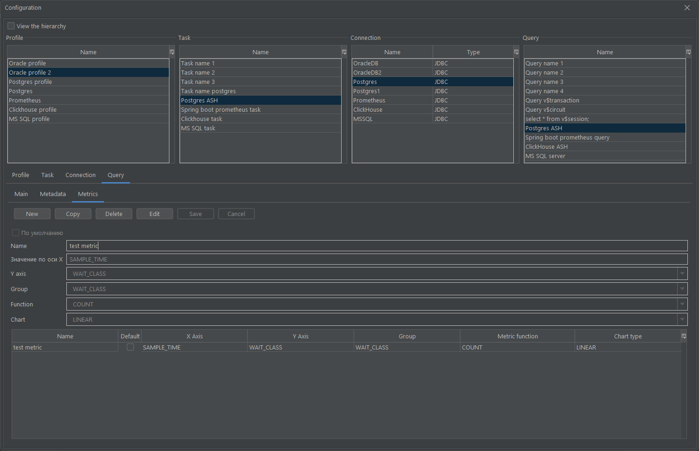

В интерфейсе приложения доступны два режима: **Просмотр** и **Редактирование** данных.

- В режиме **Просмотр** данные отображаются с учетом иерархической структуры, которая формируется на основе профилей.
  Каждый профиль может содержать несколько заданий, каждое из которых может включать несколько запросов. Каждое задание связано с одним подключением, что позволяет выполнять несколько запросов к одному источнику данных.<a href="media/config/view.gif"  target="_blank">Screencast </a>

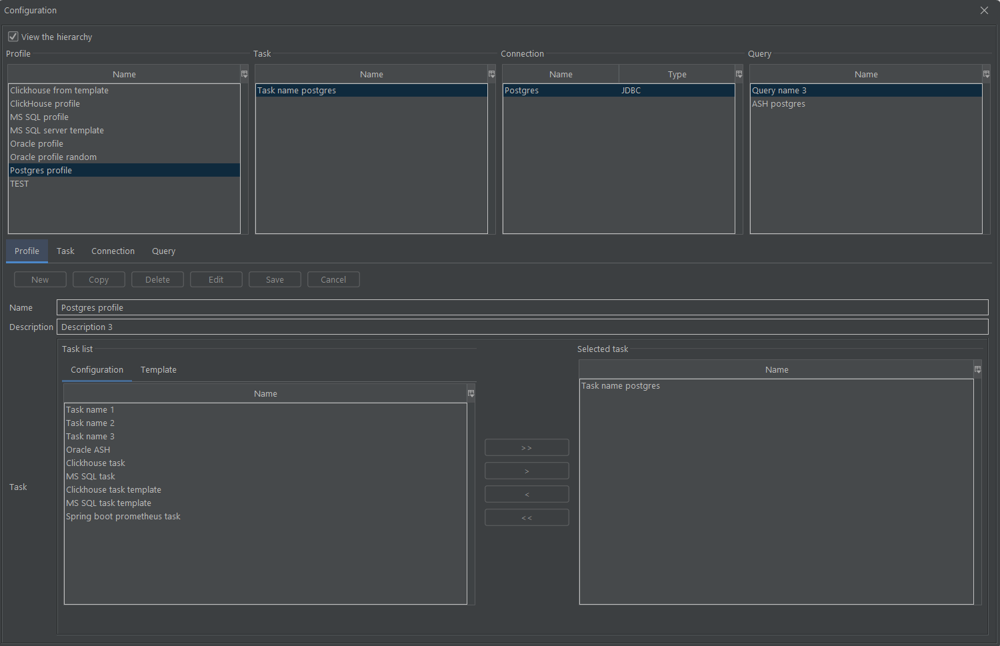

- В режиме **Редактирование** пользователь имеет возможность создавать новые объекты, копировать, удалять и изменять уже существующие. <a href="media/config/edit.gif"  target="_blank">Screencast</a>


В приложении имеется функционал, позволяющий создавать профиль с использованием предварительно созданных шаблонов заданий, подключений и запросов, которые доступны в интерфейсе **Настройки** и **Шаблоны**.

[Вернуться в оглавление](#содержание)

## Сбор данных

В приложении сбор данных производится с удаленных систем по протоколу JDBC, HTTP (Prometheus) или напрямую из приложения. Поддерживаются все источники данных для которых разработан соответствующий JDBC драйвер.

Логика получения данных временных рядов зависит от того, где эти данные собираются.

1. Если данные по таблице из удаленной системы заполняются на сервере, то мы выбираем опцию **Сбор данных на сервере**. В приложении отслеживается указатель на метку времени последней выбранной записи, затем подгружаются данные в локальную БД, которые были добавлены на удаленной системе.
2. Вариант **Сбор данных на клиенте** позволяет собирать данные удаленной системы и сохранять их локально, метки времени отслеживаются приложением.

Метки времени отслеживаются по столбцу с типом данных **Timestamp**, которая определяется в настройках по таблице. В интерфейсе конфигурации эта настройка располагается в **Запросы** -> **Метаданные** -> **Выпадающий список Timestamp**.

[Вернуться в оглавление](#содержание)

## Хранение данных

Хранение данных в приложении реализованно с использованием специализированной системы хранения блочно-колоночного типа со сжатием **Dimension DB** (репозитории [**GitFlic**](https://gitflic.ru/project/akardapolov/dimension-db) и [**GitHub**](https://github.com/akardapolov/dimension-db)).

Настройки БД располагаются в интерфейсе **Запросы** -> **Метаданные**. Поддерживается обычные таблицы и таблицы для хранения данных временных рядов. Доступны три типа хранения данных по столбцам: RAW, ENUM and HISTOGRAM.
Типы хранения данных по столбцам определяются в настройках на уровне таблицы или блока (настройка **Глобальное** или **Локальное** индексирование).
Локальное индексирование на уровне блока - это функция по автоматическому выбору соответствующего типа хранения для блока на основе распределения данных. Выбор типа хранения в данном варианте производится автоматически. Поддерживается сжатие данных.
Настройки по сжатию данных и выбору типа хранения производится динамически.

[Вернуться в оглавление](#содержание)

## Шаблоны для сбора данных

В интерфейсе **Templates** отображаются настройки шаблонов: список шаблонов по заданиям, запросам и подключениям.

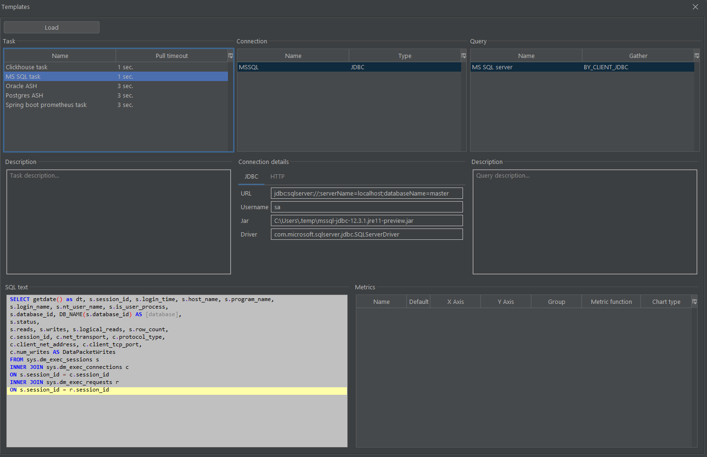

По нажатии на кнопку **Load**, возможна загрузка данных по выбранному шаблону задания, подключения и запроса в отдельный  профиль, для которого указывается его имя и описание

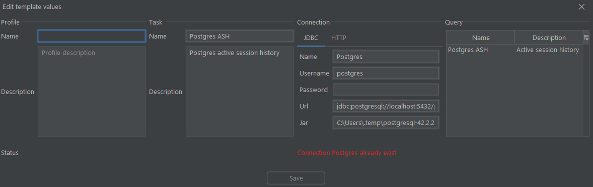

Интеграция шаблонов встроена также и в систему хранения и выбора настроек приложения. Элементы интерфейса (вкладка **Templates**, и список подключений **List of templates**) 

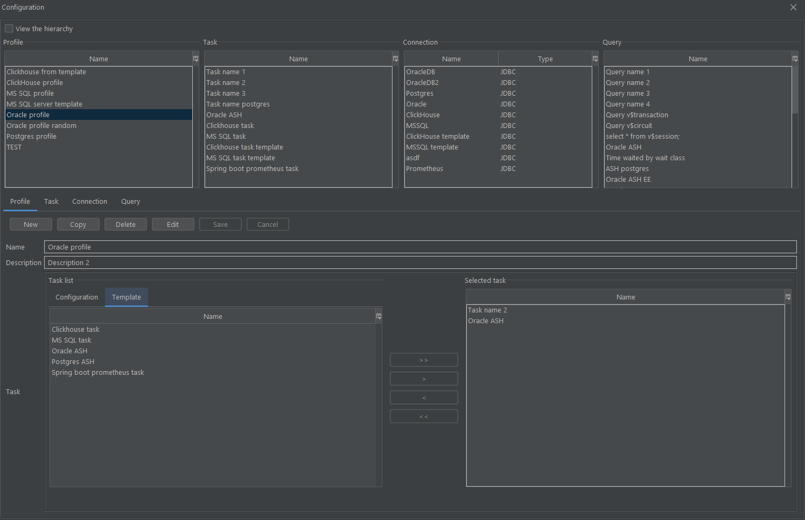


[Вернуться в оглавление](#содержание)

## Визуализация данных

В приложении поддерживаются четыре варианта отображения данных, которые располагаются в интерфейсах **Workspace** и **Dashboard**:

В интерфейсе **Workspace**: 

1. В режиме реального времени, когда данные визуализируются по мере их поступления.
   Для отображения данных в этом режиме необходима выбрать соответствующую метрику или столбец запроса в интерфейсе **Real-time**.
   В интерфейсе **Details** есть возможность выбора функций **Count**, **Sum** и **Average**. Для числовых значений возможен выбор любой из этих функций, для строковых данных нельзя вызвать подсчет суммы и расчет среднего значения. <a href="media/view/real-time.gif"  target="_blank">Screencast </a>


2. В историческом разрезе, когда данные отображаются за предыдущий период наблюдения.
   Для этого необходимо выбрать метрику или столбец запроса и указать диапазон в интерфейсе **History**, при выборе поля **Custom** есть возможность более детального выбора диапазона при помощи интерфейсов **Relative** и **Absolute**.<a href="media/view/history.gif"  target="_blank"> Screencast</a>

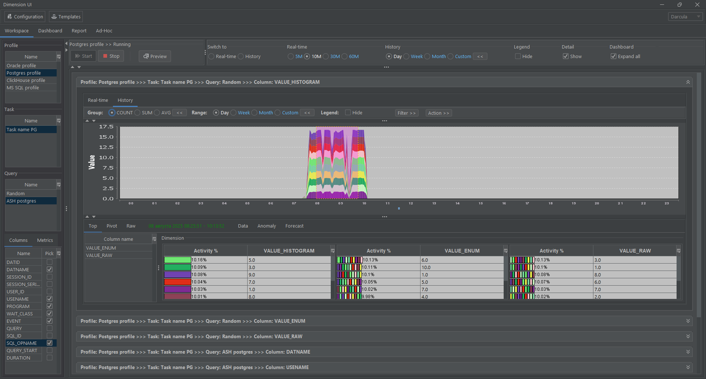

3. Ad-hoc запросы, когда данные отображаются по определенному ключевому слову. Для этого необходимо перейти в интерфейс Search, указать подстроку для поиска и нажать кнопку Go.<a href="media/view/search.gif"  target="_blank"> Screencast</a>


4. Отображение многомерных данных в виде сводного отчета **Pivot** с поддержкой расчёта итогов по строкам и столбцам.

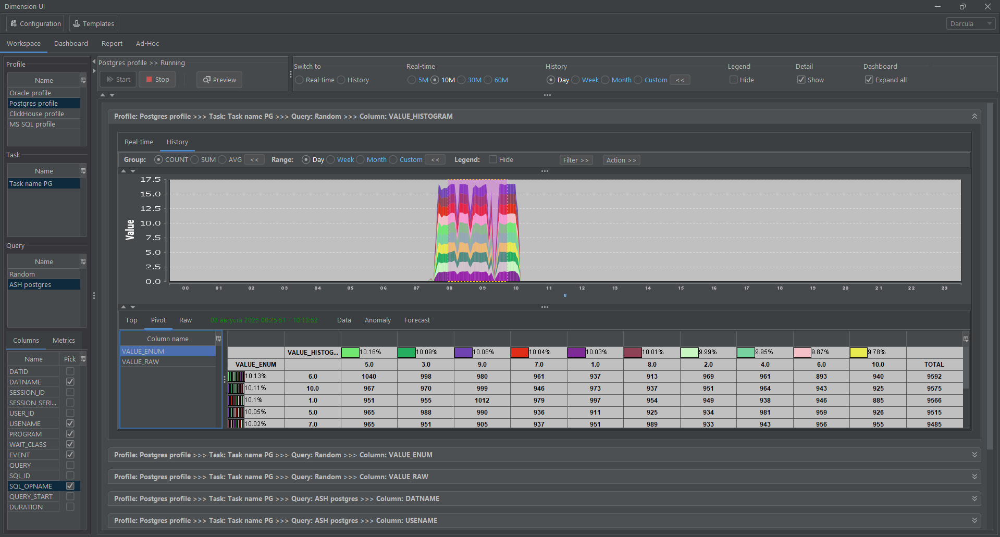

В интерфейсе **Dashboard** можно отображать данные в режиме реального времени, одновременно отслеживая несколько выбранных метрик и столбцов из запущенных профилей.


[Вернуться в оглавление](#содержание)

## Анализ данных

 Доступна функциональность анализа данных в интерфейсе **Analyze**. По выбору определенного диапазона получить топ связанных с выбранным измерением в блоке **Visualize** показателей для всех остальных измерений (для числовых данных) и затем по ним получить также обновляемый в режиме реального времени график, но уже с выбранным фильтром:


Для истории логика отображения похожа, за исключением того что данные не обновляются, а выводятся только те диапазоны, которые выбраны в блоке **Visualize**. 


Eсть возможность скрывать данные по показателям в легенде, это удобно в случае длинных наименований показателей измерений.

Для анализа данных, график каждого выбранного измерения разделен на блоки: **Данные** (**Data**), **Аномалия** (**Anomaly**) и **Прогнозирование** (**Forecast**). В блоке **Data** отображаются графики по собранным данным по выбранному диапазону, в **Anomaly** и **Forecast** результаты анализа данных с использованием подключенных алгоритмов **Matrix Profile** и библиотеки алгоритмов **Smile** в виде графиков. Данный вид интерфейса отображается для каждого выбранного измерения.

Для блока **Anomaly** в верхней части интерфейса отображаются доступные алгоритмы (на скриншоте это **STAMP**), в левой части отображаются все доступные показатели измерений, при выборе значения из списка пользователь получает график расчета **Matrix Profile**, где *максимумы* в верхней части графика – это *аномалии в данных*, *минимумы* в нижней части – это *повторяющиеся значения в показателях*.

Для блока **Forecast** в верхней части интерфейса также отображаются доступные алгоритмы (на скриншоте это **ARMA**), в левой части отображаются все доступные показатели измерений, при выборе значения из списка пользователь получает график с данными и продолженные значения прогноза (штриховой линией).


Для каждого выбранного (для **Anomaly** и для **Forecast**) алгоритма есть возможность управлять его настройками через форму настроек **Settings**. 

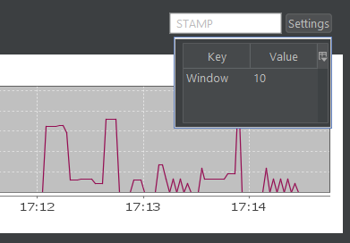 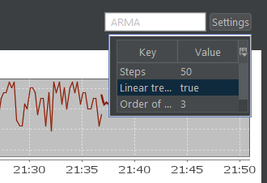

[Вернуться в оглавление](#содержание)

## Система отчетов

В приложении есть функция создания отчетов в формате PDF.

### Настройка параметров отчета

Для настройки параметров отчета необходимо выбрать соответствущие профиль, задание и запрос и затем соответствующую 
метрику или столбец запроса в интерфейсе **Report**. На вкладке **Design** есть возможность выбора диапазона дат.
После отображения дизайна будущего отчета можно отредактировать описание, можно выбрать нужную из функций **Count**, **Sum** и 
**Average**. Для числовых значений возможен выбор любой из этих функций, для строковых данных нельзя вызвать подсчет суммы и
расчет среднего значения.


### Генерация отчета

После того как пользователь настроил все необходимые параметры отчета, он запускает процесс генерации отчета посредством
кнопки **Report**  <a href="media/report/report.gif"  target="_blank">Screencast</a>


### Просмотр отчета

Созданный отчет в формате PDF отображается на вкладке **Report**, предназначенной для просмотра отчетов. В отчете все данные из дизайна: графики, таблицы и комментарии.


### Экспорт отчета

Пользователю предоставляется возможность экспортировать отчет в формате PDF. Для этого, с помощью кнопки **Save** можно выбрать директорию для сохранения файла отчета.

[Вернуться в оглавление](#содержание)

##  Специализированные запросы к данным Ad-hoc

В интерфейсе **Ad-Hoc** в левой части список **JDBC** подключений, по клику на подключение автоматически собирается информация по таблицам и представлениям используемым в различных схемам и каталогах БД, по клику на каждую таблицу в верхней части заполняется интерфейс в котором отображаются метаданные по таблицы (имена метрик, типы данных для хранения временных метрик). Выбирая метрику и столбец для хранения временных метрик можно получить в результате график функции по данному запросу. Есть возможность указывать диапазон дат (последний день, неделя месяц или произвольный диапазон дат в **Custom**). 

Выбирая диапазон данных на **Stacked** графике отображается детализация в виде **Gantt** и **Pivot** графиков по выбранной зависимой от основной метрики


[Вернуться в оглавление](#содержание)

## Алгоритм


[Вернуться в оглавление](#содержание)

## Screencast

|               | Screencast                                                                   |
|:--------------|:-----------------------------------------------------------------------------|
| Configuration | <a href="media/config/configuration.gif"  target="_blank">Configuration </a> |
| Workspace     | <a href="media/workspace/workspace.gif"  target="_blank">Workspace </a>      |
| Dashboard     | <a href="media/dashboard/dashboard.gif"  target="_blank">Dashboard </a>      |
| Report        | <a href="media/report/report.gif"  target="_blank">Report </a>               |   
| Ad-hoc        | <a href="media/adhoc/adhoc.gif"  target="_blank">Ad-hoc </a>                 |   

[Вернуться в оглавление](#содержание)

## Лицензия
[](https://opensource.org/licenses/Apache-2.0)
Код выпущен под лицензией Apache License Version 2.0

[Вернуться в оглавление](#содержание)

## Поддержка
Разработано при поддержке ["Фонда содействия инновациям"](https://fasie.ru/) по конкурсу ["Код-Цифровые технологии"](https://fasie.ru/press/fund/kod-dt/) - ["Результаты"](https://fasie.ru/press/fund/kod-dt-results/) в рамках национальной программы [«Цифровая экономика Российской Федерации»](https://digital.gov.ru/ru/activity/directions/858/).

[Вернуться в оглавление](#содержание)

## Контакты
[@akardapolov](mailto:akardapolov@yandex.ru)

[Вернуться в оглавление](#содержание)